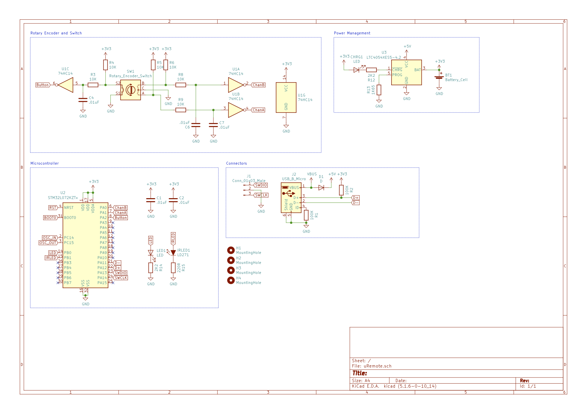

# uRemote

uRemote is a general purpose IR/USB remote. There are two inputs:

1. Rotary Encoder
2. Momentary Switch

Currently, the firmware transmits IR NEC-encoded volume and power signals to a Visio V405-G9 tv. 

